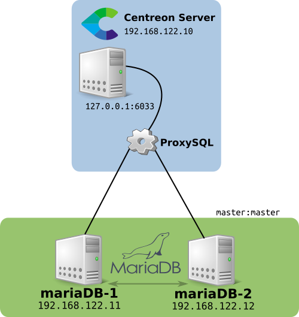
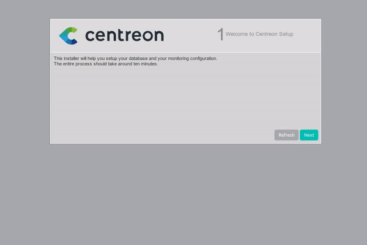

# Centreon in a MariaDB Cluster (Galera)



Environment:

 - MariaDB Server 1 = 192.168.122.11
 - MariaDB Server 2 = 192.168.122.12
 - Centreon server with ProxySQL = 192.168.122.10

Install MariaDB Repositories:

```sh
curl -sS https://downloads.mariadb.com/MariaDB/mariadb_repo_setup | bash
```

* Read MariaDB documentation:
https://mariadb.com/kb/en/library/yum/

Install MariaDB with Galera Cluster:

```sh
yum install -y MariaDB-server MariaDB-client galera-4
```

Add entries in /etc/hosts to resolve dns to servers internally:

```sh
echo '192.168.122.11   mariadb1.lab    mariadb1' >> /etc/hosts
echo '192.168.122.12    mariadb2.lab    mariadb2' >> /etc/hosts
```

Add rules to firewall:

```sh
firewall-cmd --permanent --zone=public --add-port=3306/tcp
firewall-cmd --permanent --zone=public --add-port=4567/tcp
firewall-cmd --permanent --zone=public --add-port=4568/tcp
firewall-cmd --permanent --zone=public --add-port=4444/tcp
firewall-cmd --permanent --zone=public --add-port=4567/udp

firewall-cmd --reload
```

Configure Galera cluster in MariaDB configuration file:

Stop service MariaDB in both servers:

```sh
systemctl stop mysql
```

It is necessary to modify LimitNOFILE limitation:

```sh
mkdir -p  /etc/systemd/system/mariadb.service.d/
echo -ne "[Service]\nLimitNOFILE=32000\n" | tee /etc/systemd/system/mariadb.service.d/limits.conf
systemctl daemon-reload
```

On both servers, add these line to `/etc/my.cnf.d/server.cnf` in serssion `[mysqld]`:

```
[mysqld]
open_files_limit=32000
```

on node 1 (`mariadb1`), in file `/etc/my.cnf.d/server.cnf` edit session `[galera]` with
this options:

```
wsrep_on=ON
wsrep_provider=/usr/lib64/galera-4/libgalera_smm.so
wsrep_cluster_name="centreon"
wsrep_cluster_address="gcomm://mariadb1.lab,mariadb2.lab"
wsrep_node_address="mariadb1.lab"
wsrep_node_name="mariadb1"
binlog_format=row
default_storage_engine=InnoDB
innodb_autoinc_lock_mode=2
```

Now on node 2, the same thing, change only the options `wsrep_node_*`:

```
wsrep_on=ON
wsrep_provider=/usr/lib64/galera-4/libgalera_smm.so
wsrep_cluster_name="centreon"
wsrep_cluster_address="gcomm://mariadb1.lab,mariadb2.lab"
wsrep_node_address="mariadb2.lab"
wsrep_node_name="mariadb2"
binlog_format=row
default_storage_engine=InnoDB
innodb_autoinc_lock_mode=2
```

Bootstrapping a new cluster:

on node 1 (`mariadb1`)

```sh
systemctl stop mysql
galera_new_cluster
```

Now, start MariaDB service on node 2:

```
systemctl start mysql
```

Restart the node 1 (`stop` and `start`):

```sh
systemctl stop mysql
sleep 15
systemctl start mysql
```


Installing SQL Proxy:

```sh
yum install https://github.com/sysown/proxysql/releases/download/v2.0.6/proxysql-2.0.6-1-centos7.x86_64.rpm
```

Get the last version from:
https://github.com/sysown/proxysql/releases

```sh
systemctl enable proxysql
systemctl start proxysql
```

Install a Mysql client:

```sh
yum install -y mariadb
```

Connect to console of administration of ProxySQL:

```sh
mysql -u admin -padmin -h 127.0.0.1 -P6032 --prompt='Admin>'
```

In console, add the servers of MariaDB of cluster:

Node 1:

```sql
INSERT INTO mysql_servers(hostgroup_id, hostname, port) VALUES (0,'192.168.122.11',3306);
```

Node 2:

```sql
INSERT INTO mysql_servers(hostgroup_id, hostname, port) VALUES (0,'192.168.122.12',3306);
```

Load and save configurations:

```sql
LOAD MYSQL SERVERS TO RUNTIME;
SAVE MYSQL SERVERS TO DISK;
```

On MariaDB server (any node), add a user to ProxySQL monitor the server:

```sql
CREATE USER 'proxysql'@'%' IDENTIFIED BY 'ProxySQLPASSWORD';
GRANT USAGE ON *.* TO 'proxysql'@'%';
```

Now, you must be set user and password in console admin of ProxySQL:

```sql
UPDATE global_variables SET variable_value='proxysql' WHERE variable_name='mysql-monitor_username';
UPDATE global_variables SET variable_value='ProxySQLPASSWORD' WHERE variable_name='mysql-monitor_password';
LOAD MYSQL VARIABLES TO RUNTIME;
SAVE MYSQL VARIABLES TO DISK;
```

Verify the monitor with these commands:

```sql
SELECT * FROM monitor.mysql_server_connect_log ORDER BY time_start_us DESC;
SELECT * FROM monitor.mysql_server_ping_log ORDER BY time_start_us DESC;
```

Ok, ProxySQL is ready to use. Now, We will set the users used by Centreon over ProxySQL:

Set the `root` and `centreon` user in ProxySQL (change password to you):

```sql
INSERT INTO mysql_users (username,password) VALUES ('root', 'c3ntr30n');
INSERT INTO mysql_users (username,password) VALUES ('centreon', 'c3ntr30n');
LOAD MYSQL USERS TO RUNTIME;
SAVE MYSQL USERS TO DISK;
```

On the MariaDB server (any node), create the user's:

```sql
CREATE USER 'root'@'192.168.122.10' IDENTIFIED BY 'c3ntr30n';
GRANT ALL ON *.* TO 'root'@'192.168.122.10';
CREATE USER 'centreon'@'192.168.122.10' IDENTIFIED BY 'c3ntr30n';
GRANT ALL ON *.* TO 'centreon'@'192.168.122.10';
```

All right, all are done, ready to install Centreon:

For installation, We need to disable one of the nodes, leaving only one active,
as there are many tables and rules to create, there may be inconsistency when
balancing the connections, so we will only use one node, once installed, enable again.

```sql
UPDATE mysql_servers SET status='OFFLINE_SOFT' WHERE hostname='192.168.122.12';
```

Let's now install Centreon, I already left a command recipe ready here:

```sh
yum install -y centos-release-scl wget curl
yum install -y yum-utils http://yum.centreon.com/standard/19.10/el7/stable/noarch/RPMS/centreon-release-19.10-1.el7.centos.noarch.rpm
yum-config-manager --enable 'centreon-testing*'
yum install -y centreon-base-config-centreon-engine

echo "date.timezone = Europe/Lisbon" > /etc/opt/rh/rh-php72/php.d/php-timezone.ini

systemctl enable httpd24-httpd
systemctl enable snmpd
systemctl enable snmptrapd
systemctl enable rh-php72-php-fpm
systemctl enable centcore
systemctl enable centreontrapd
systemctl enable cbd
systemctl enable centengine
systemctl enable centreon
systemctl restart rh-php72-php-fpm
systemctl stop firewalld
systemctl disable firewalld
systemctl start rh-php72-php-fpm
systemctl start httpd24-httpd
systemctl start cbd
systemctl start snmpd
systemctl start snmptrapd
```

That done, it is time to configure Centreon through the web interface. The procedure
is the same as the documentation, only paying attention to the connection data,
since we will use ProxySQL as a MariaDB cluster connection proxy.



After the installation, we will turn on the node that we left OFF:

```sh
mysql -u admin -padmin -h 127.0.0.1 -P6032 --prompt='Admin>'
```

```sql
UPDATE mysql_servers SET status='ONLINE' WHERE hostname='192.168.122.12';
```

Now we have Centreon ready to use and its data replicated and balanced between MariaDB servers.


Here we have a quick screencast about this installation:

[](http://www.youtube.com/watch?v=aDhgo9JDFtA)
